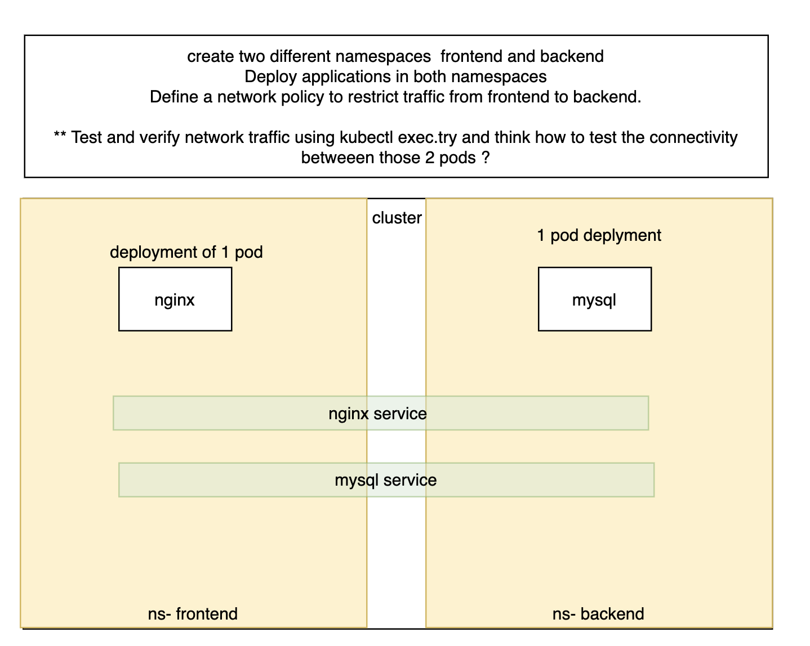

# servies and networks

- You'll create a realistic microservices scenario where a frontend application needs to communicate with a backend service, but you want to implement security controls to restrict this traffic according to the principle of least privilege.Detailed Steps1. Create Two Namespaces
* Create a frontend namespace for your user-facing applications
* Create a backend namespace for your internal services/APIs
This separation mimics real-world architecture where different application tiers are logically isolated
2. Deploy Applications in Both Namespaces
* nignx 
* mysql

- Frontend namespace: Deploy a simple web application or nginx pod that will act as the client
- Backend namespace: Deploy a service (e.g., nginx, httpd, or a simple API server) that will act as the server

- Expose the backend application using a Kubernetes Service so it can be accessed by other pods
Label your pods appropriately (e.g., app=frontend, app=backend) as these labels will be crucial for Network selectors

# Use various testing methods to verify your Network Policy is working:
## Testing Scenarios:
- Positive Test - Allowed Traffic:
    * Use kubectl exec to get a shell into the frontend pod
    * Try to reach the backend service using curl or wget
    * This should succeed if your Network Policy is correctly configured
* Example: curl http://{{backend-service}}.{{backend}}.{{svc}}.{{cluster}}.local
- Negative Test - Blocked Traffic:
    * Create a test pod in a different namespace (or default namespace)
    * Try to reach the backend service from this unauthorized pod
    * This should fail/timeout proving your Network Policy is blocking unauthorized traffic
- Connectivity Testing Methods:
- HTTP requests: Use curl, wget, or nc (netcat) to test HTTP connectivity
- DNS resolution: Verify DNS works with nslookup or dig
- Port checking: Use telnet or nc to check if ports are reachable
- Ping test: Try ICMP ping (note: many Network Policies don't affect ICMP by default)

