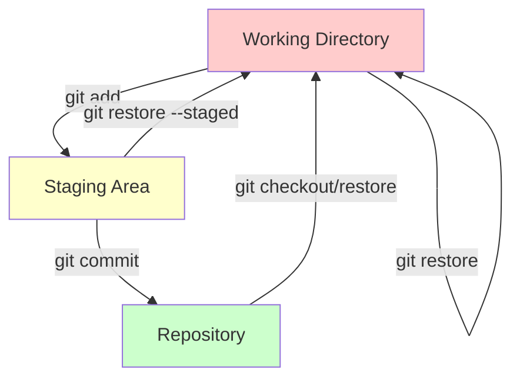
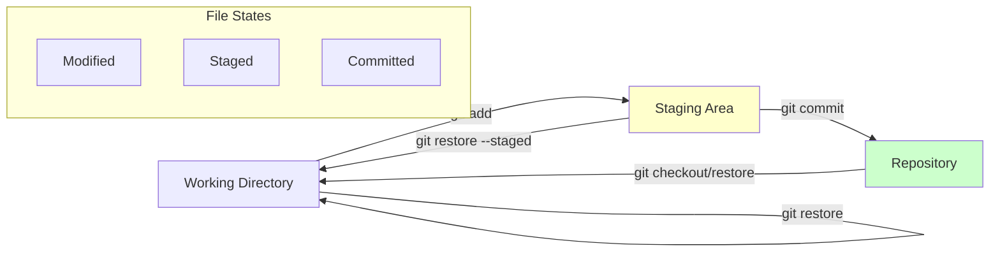
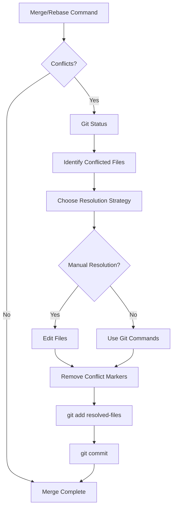
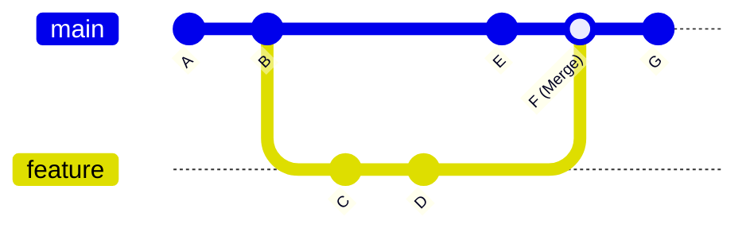
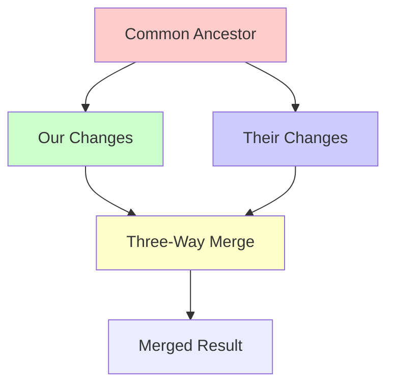

# Git Tutorial 
## Table of Contents
1. [Git Configuration](#git-configuration)
2. [Understanding Git Status](#understanding-git-status)
3. [Adding Files and Committing](#adding-files-and-committing)
4. [Restoring from Commits](#restoring-from-commits)
5. [Restoring from Staging Area](#restoring-from-staging-area)
6. [Branching Strategies](#branching-strategies)
7. [Handling Conflicts](#handling-conflicts)
8. [Merge Resolution](#merge-resolution)
9. [Three-Way Merge](#three-way-merge)
10. [Git Cheat Sheet](#git-cheat-sheet)

---

## Git Configuration

Before diving into Git operations, proper configuration is crucial for a DevOps environment.

### Global Configuration

```bash
# Set your identity (required for commits)
git config --global user.name "Your Name"
git config --global user.email "your.email@company.com"

# Set default branch name
git config --global init.defaultBranch main

# Set default editor
git config --global core.editor "code --wait"  # VS Code
git config --global core.editor "vim"          # Vim

# Configure line endings (important for cross-platform teams)
git config --global core.autocrlf input   # Linux/Mac
git config --global core.autocrlf true    # Windows

# Set up aliases for common commands
git config --global alias.st status
git config --global alias.co checkout
git config --global alias.br branch
git config --global alias.ci commit
git config --global alias.unstage 'reset HEAD --'
git config --global alias.last 'log -1 HEAD'
git config --global alias.visual '!gitk'
```

### Repository-Specific Configuration

```bash
# Set configuration for current repo only
git config user.name "DevOps Team Lead"
git config user.email "devops@company.com"

# View all configurations
git config --list
git config --global --list
git config --local --list
```

### Configuration Hierarchy

| Level | Command | File Location | Priority |
|-------|---------|---------------|----------|
| System | `--system` | `/etc/gitconfig` | Lowest |
| Global | `--global` | `~/.gitconfig` | Medium |
| Local | `--local` | `.git/config` | Highest |

---

## Understanding Git Status

`git status` is your most important diagnostic tool. It shows the state of your working directory and staging area.

### Basic Status Command

```bash
git status
git status --short    # Abbreviated output
git status -s         # Same as --short
```

### Status Output Interpretation

```bash
# Example output
$ git status
On branch feature/user-auth
Your branch is ahead of 'origin/feature/user-auth' by 2 commits.
  (use "git push" to publish your local commits)

Changes to be committed:
  (use "git restore --staged <file>..." to unstage)
        new file:   src/auth/login.js
        modified:   src/auth/middleware.js

Changes not staged for commit:
  (use "git add <file>..." to update what will be committed)
  (use "git restore <file>..." to discard changes in working directory)
        modified:   README.md
        deleted:    old/deprecated.js

Untracked files:
  (use "git add <file>..." to include in what will be committed)
        config/new-feature.json
```

### Git Status Diagram



### Short Status Symbols

| Symbol | Meaning |
|--------|---------|
| `??` | Untracked files |
| `A` | Added to staging |
| `M` | Modified |
| `D` | Deleted |
| `R` | Renamed |
| `C` | Copied |
| `U` | Updated but unmerged |

Example short status:
```bash
$ git status -s
 M README.md        # Modified, not staged
M  src/auth.js      # Modified and staged
A  new-file.txt     # Added to staging
?? untracked.log    # Untracked file
```

---

## Adding Files and Committing

The process of moving changes from working directory to repository involves staging (adding) and committing.

### Adding Files to Staging

```bash
# Add specific file
git add filename.txt

# Add multiple files
git add file1.txt file2.js file3.css

# Add all files in current directory
git add .

# Add all files in repository
git add -A
git add --all

# Add only modified and deleted files (not new files)
git add -u
git add --update

# Interactive adding (choose what to add)
git add -i
git add --interactive

# Add parts of a file (patch mode)
git add -p filename.txt
git add --patch filename.txt
```

### Committing Changes

```bash
# Basic commit
git commit -m "Add user authentication feature"

# Commit with detailed message
git commit -m "Add user authentication feature" -m "
- Implement JWT token validation
- Add password hashing with bcrypt
- Create middleware for protected routes
- Add unit tests for auth functions
"

# Commit all tracked files (skip staging)
git commit -a -m "Quick fix for production bug"

# Amend the last commit (change message or add files)
git commit --amend -m "New commit message"

# Commit with author information
git commit --author="John Doe <john@example.com>" -m "Fix contributed by John"
```

### Commit Message Best Practices

```bash
# Good commit message format:
# <type>(<scope>): <subject>
# 
# <body>
# 
# <footer>

git commit -m "feat(auth): add OAuth2 integration

Implemented Google and GitHub OAuth2 providers
- Added OAuth2 service layer
- Created redirect handlers
- Updated user model to support OAuth

Closes #123
Breaking change: Auth endpoints moved to /v2/auth"
```

### Commit Types for DevOps

| Type | Description | Example |
|------|-------------|---------|
| `feat` | New feature | `feat(api): add user registration endpoint` |
| `fix` | Bug fix | `fix(auth): resolve token expiration bug` |
| `docs` | Documentation | `docs(readme): update installation guide` |
| `style` | Formatting | `style(css): fix indentation in main.css` |
| `refactor` | Code restructuring | `refactor(db): optimize user query performance` |
| `test` | Adding tests | `test(auth): add unit tests for login flow` |
| `chore` | Maintenance | `chore(deps): update lodash to v4.17.21` |
| `ci` | CI/CD changes | `ci(github): add automated testing workflow` |
| `deploy` | Deployment | `deploy(prod): update production configuration` |

---

## Restoring from Commits

Restoring files from commits is crucial for recovering lost work or reverting unwanted changes.

### Using git restore (Modern Approach)

```bash
# Restore file from last commit
git restore filename.txt

# Restore file from specific commit
git restore --source=HEAD~2 filename.txt
git restore --source=abc1234 filename.txt

# Restore all files from last commit
git restore .

# Restore file to a different location
git restore --source=HEAD~1 --worktree --staged filename.txt
```

### Using git checkout (Traditional Approach)

```bash
# Restore file from last commit
git checkout HEAD -- filename.txt

# Restore file from specific commit
git checkout abc1234 -- filename.txt

# Restore entire directory
git checkout HEAD -- src/

# Create new branch from specific commit and check it out
git checkout -b hotfix/urgent-fix abc1234
```

### Using git reset

```bash
# Soft reset - keep changes in staging
git reset --soft HEAD~1

# Mixed reset - keep changes in working directory (default)
git reset HEAD~1
git reset --mixed HEAD~1

# Hard reset - discard all changes (DANGEROUS!)
git reset --hard HEAD~1

# Reset to specific commit
git reset --hard abc1234
```

### Recovery Scenarios

#### Scenario 1: Accidentally modified a file
```bash
# Check what changed
git diff filename.txt

# Restore from last commit
git restore filename.txt

# Or restore from specific commit
git restore --source=HEAD~2 filename.txt
```

#### Scenario 2: Need to undo last commit but keep changes
```bash
# Undo last commit, keep changes staged
git reset --soft HEAD~1

# Undo last commit, keep changes in working directory
git reset HEAD~1
```

#### Scenario 3: Complete disaster recovery
```bash
# Find the commit you want to return to
git log --oneline

# Hard reset to that commit (BE CAREFUL!)
git reset --hard abc1234

# If you need to recover after hard reset
git reflog
git reset --hard HEAD@{1}
```

---

## Restoring from Staging Area

Managing the staging area is crucial for clean commits and proper change management.

### Unstaging Files

```bash
# Unstage specific file (modern way)
git restore --staged filename.txt

# Unstage specific file (traditional way)
git reset HEAD filename.txt

# Unstage all files
git restore --staged .
git reset HEAD .

# Unstage and discard changes
git restore --staged --worktree filename.txt
```

### Staging Area Scenarios

#### Scenario 1: Added wrong file to staging
```bash
# Check what's staged
git status

# Unstage the wrong file
git restore --staged wrong-file.txt

# Or reset specific file
git reset HEAD wrong-file.txt
```

#### Scenario 2: Partial staging cleanup
```bash
# See what's staged vs working directory
git diff --staged    # Changes in staging
git diff            # Changes in working directory

# Unstage everything
git restore --staged .

# Re-add only what you want
git add correct-file.txt
```

#### Scenario 3: Interactive unstaging
```bash
# Interactive mode for selective unstaging
git reset -p

# This will ask for each change:
# Stage this hunk [y,n,q,a,d,/,s,e,?]?
```

### Staging Workflow Diagram



---

## Branching Strategies

Branching is fundamental to DevOps workflows. Here are common patterns and commands.

### Basic Branch Operations

```bash
# List branches
git branch              # Local branches
git branch -r           # Remote branches
git branch -a           # All branches
git branch -v           # Verbose (shows last commit)

# Create new branch
git branch feature/new-api
git branch hotfix/critical-bug

# Create and switch to new branch
git checkout -b feature/user-dashboard
git switch -c feature/user-dashboard    # Modern alternative

# Switch branches
git checkout main
git switch main         # Modern alternative

# Delete branch
git branch -d feature/completed-feature    # Safe delete
git branch -D feature/broken-feature       # Force delete

# Delete remote branch
git push origin --delete feature/old-branch
```

### Common Branching Models

#### Git Flow Model


#### Feature Branch Workflow

```bash
# Start new feature
git checkout main
git pull origin main
git checkout -b feature/payment-integration

# Work on feature
git add .
git commit -m "feat(payment): add Stripe integration"
git push origin feature/payment-integration

# Create pull request (via GitHub/GitLab UI)
# After approval, merge and cleanup
git checkout main
git pull origin main
git branch -d feature/payment-integration
```

### Advanced Branching

```bash
# Track remote branch
git checkout --track origin/feature/remote-branch

# Set upstream for existing branch
git branch --set-upstream-to=origin/feature/my-feature

# Rename branch
git branch -m old-name new-name
git branch -m new-name  # Rename current branch

# Compare branches
git diff main..feature/new-api
git diff --name-only main..feature/new-api

# Show branch relationships
git show-branch
git log --graph --oneline --all
```

### Branch Management Table

| Command | Purpose | Example |
|---------|---------|---------|
| `git branch` | List local branches | `git branch -v` |
| `git checkout -b` | Create and switch | `git checkout -b hotfix/db-fix` |
| `git switch -c` | Modern create/switch | `git switch -c feature/api-v2` |
| `git branch -d` | Safe delete | `git branch -d feature/completed` |
| `git branch -D` | Force delete | `git branch -D feature/broken` |
| `git push origin --delete` | Delete remote | `git push origin --delete feature/old` |

---

## Handling Conflicts

Conflicts occur when Git cannot automatically merge changes. Here's how to handle them like a DevOps pro.

### Understanding Conflicts

Conflicts happen when:
- Same lines are modified in different branches
- File is deleted in one branch, modified in another
- Binary files are changed in both branches

### Conflict Markers

```bash
# Example conflict in a file
<<<<<<< HEAD (current branch)
const API_URL = 'https://api.production.com';
=======
const API_URL = 'https://api.staging.com';
>>>>>>> feature/api-update
```

### Resolving Conflicts Manually

```bash
# After conflict occurs during merge
git status    # Shows conflicted files

# Edit the conflicted files to resolve conflicts
# Remove conflict markers and choose the correct content

# Mark as resolved
git add conflicted-file.js

# Complete the merge
git commit
```

### Using Merge Tools

```bash
# Configure merge tool
git config --global merge.tool vimdiff
git config --global merge.tool code      # VS Code
git config --global merge.tool meld      # Meld (Linux)

# Launch merge tool for conflicts
git mergetool

# Skip merge tool for specific file
git mergetool --no-prompt filename.js
```

### Conflict Resolution Strategies

#### Strategy 1: Accept All Changes from One Side

```bash
# Accept all changes from current branch (HEAD)
git checkout --ours conflicted-file.js

# Accept all changes from incoming branch
git checkout --theirs conflicted-file.js

# For entire merge, use strategy
git merge -X ours feature/branch-name
git merge -X theirs feature/branch-name
```

#### Strategy 2: Manual Resolution

```bash
# 1. Identify conflicted files
git diff --name-only --diff-filter=U

# 2. Open each file and manually resolve
# Look for conflict markers: <<<<<<<, =======, >>>>>>>

# 3. Clean resolution example:
# Before:
# <<<<<<< HEAD
# const timeout = 5000;
# =======
# const timeout = 10000;
# >>>>>>> feature/longer-timeout

# After (choose one or combine):
const timeout = process.env.NODE_ENV === 'production' ? 10000 : 5000;

# 4. Stage resolved files
git add resolved-file.js

# 5. Complete merge
git commit -m "resolve: merge conflicts in timeout configuration"
```

#### Strategy 3: Abort and Restart

```bash
# If resolution gets too complex
git merge --abort
git rebase --abort

# Start over with different strategy
git merge --no-commit feature/branch-name
# Resolve conflicts step by step
git commit
```

### Preventing Conflicts

```bash
# Keep branches updated
git checkout feature/my-branch
git merge main          # Merge main into feature branch
# Or use rebase for cleaner history
git rebase main

# Pull latest changes regularly
git pull origin main

# Use smaller, focused commits
git add -p  # Partial staging for focused commits
```

### Conflict Resolution Workflow



---

## Merge Resolution

Different merge strategies for different scenarios in DevOps workflows.

### Types of Merges

#### Fast-Forward Merge

```bash
# When target branch hasn't diverged
git checkout main
git merge feature/simple-fix

# Force merge commit even for fast-forward
git merge --no-ff feature/simple-fix
```

#### Three-Way Merge

```bash
# When branches have diverged
git checkout main
git merge feature/complex-feature

# This creates a merge commit automatically
```

### Merge Strategies

```bash
# Recursive (default for three-way merge)
git merge -s recursive feature/branch-name

# Octopus (for merging multiple branches)
git merge -s octopus branch1 branch2 branch3

# Ours (keep our version, ignore theirs)
git merge -s ours feature/branch-name

# Subtree (for subproject merging)
git merge -s subtree feature/library-update
```

### Merge Options

```bash
# No fast-forward (always create merge commit)
git merge --no-ff feature/important-feature

# Squash merge (combine all commits into one)
git merge --squash feature/many-small-commits
git commit -m "feat: implement user authentication system"

# Abort merge if conflicts arise
git merge --abort

# Continue merge after resolving conflicts
git merge --continue
```

### Advanced Merge Scenarios

#### Scenario 1: Feature Branch with Multiple Commits

```bash
# Option 1: Regular merge (keeps commit history)
git checkout main
git merge feature/user-profile

# Option 2: Squash merge (clean single commit)
git checkout main
git merge --squash feature/user-profile
git commit -m "feat(user): add complete user profile system

- User registration and login
- Profile editing and avatar upload
- Privacy settings
- Account deactivation"

# Option 3: Rebase and merge (linear history)
git checkout feature/user-profile
git rebase main
git checkout main
git merge feature/user-profile  # This will be fast-forward
```

#### Scenario 2: Hotfix to Multiple Branches

```bash
# Apply hotfix to main
git checkout main
git merge hotfix/security-patch

# Apply same hotfix to development
git checkout develop
git merge hotfix/security-patch

# If conflicts occur, resolve them for each branch
```

#### Scenario 3: Partial Merge (Cherry-pick)

```bash
# Pick specific commits from another branch
git cherry-pick abc1234
git cherry-pick def5678 ghi9012

# Cherry-pick range of commits
git cherry-pick abc1234..def5678

# Cherry-pick with new commit message
git cherry-pick -e abc1234
```

### Merge History Visualization



### Merge vs Rebase Comparison

| Aspect | Merge | Rebase |
|--------|--------|--------|
| History | Preserves original commits | Rewrites commit history |
| Merge commits | Creates merge commits | No merge commits |
| Conflicts | Resolve once at merge | May resolve multiple times |
| Collaboration | Safe for shared branches | Dangerous for shared branches |
| Use case | Feature integration | Clean up before sharing |

---

## Three-Way Merge

Understanding three-way merge is crucial for complex DevOps scenarios.

### What is Three-Way Merge?

Three-way merge uses three points:
1. **Common ancestor** (base)
2. **Current branch** (ours/HEAD)
3. **Target branch** (theirs)

### Three-Way Merge Process



### Manual Three-Way Merge

```bash
# Show three-way diff
git diff HEAD...feature/branch-name

# Show merge base
git merge-base HEAD feature/branch-name

# Perform merge with strategy
git merge -s recursive -X patience feature/branch-name
```

### Three-Way Merge Strategies

#### Patience Strategy
```bash
# Better for large refactoring
git merge -X patience feature/refactor-branch
```

#### Ignore Whitespace
```bash
# Ignore whitespace changes
git merge -X ignore-space-change feature/formatting-updates
git merge -X ignore-all-space feature/indentation-fix
```

#### Rename Detection
```bash
# Better rename detection
git merge -X rename-threshold=50 feature/file-reorganization
```

### Complex Three-Way Scenarios

#### Scenario 1: Code Refactoring Merge

```bash
# File: user-service.js
# Base (common ancestor):
function validateUser(user) {
    return user.email && user.password;
}

# Ours (current branch):
function validateUser(user) {
    return user.email && user.password && user.name;
}

# Theirs (incoming branch):
function validateUserCredentials(user) {
    return user.email && user.password;
}

# Three-way merge result (manual resolution needed):
function validateUserCredentials(user) {
    return user.email && user.password && user.name;
}
```

#### Scenario 2: Configuration File Merge

```bash
# config.json base:
{
    "database": {
        "host": "localhost",
        "port": 5432
    }
}

# Ours (added authentication):
{
    "database": {
        "host": "localhost",
        "port": 5432
    },
    "auth": {
        "secret": "dev-secret"
    }
}

# Theirs (changed host):
{
    "database": {
        "host": "db.example.com",
        "port": 5432
    }
}

# Auto-merged result:
{
    "database": {
        "host": "db.example.com",
        "port": 5432
    },
    "auth": {
        "secret": "dev-secret"
    }
}
```

### Advanced Three-Way Tools

#### Using git show for Analysis

```bash
# Show merge commit details
git show --cc merge-commit-hash

# Show what changed from each parent
git show --first-parent merge-commit-hash
git show --no-merges merge-commit-hash
```

#### Custom Merge Drivers

```bash
# Configure custom merge driver
git config merge.npmrc.driver 'npm-merge %O %A %B %L'
git config merge.packagelock.driver 'npm install --package-lock-only'

# In .gitattributes:
package-lock.json merge=packagelock
.npmrc merge=npmrc
```

### Three-Way Merge Best Practices

1. **Understand the base**: Always check the merge base
   ```bash
   git merge-base HEAD feature/branch-name
   git show $(git merge-base HEAD feature/branch-name)
   ```

2. **Use appropriate strategies**: Choose merge strategy based on content
   ```bash
   git merge -X rename-threshold=40 feature/reorganization
   git merge -X ignore-space-change feature/formatting
   ```

3. **Test after merge**: Always test the merge result
   ```bash
   git merge feature/new-api
   npm test  # or your test command
   # If tests fail, investigate the merge
   ```

4. **Document complex merges**: Add detailed commit messages
   ```bash
   git commit -m "merge: integrate user authentication system
   
   Three-way merge resolved conflicts in:
   - src/auth/middleware.js: Combined validation approaches
   - config/database.js: Merged connection pooling settings
   - tests/auth.test.js: Merged test suites
   
   Manual testing completed for all auth flows"
   ```

---

## Git Cheat Sheet

### Configuration Quick Reference

```bash
# Identity
git config --global user.name "Your Name"
git config --global user.email "email@example.com"

# Aliases
git config --global alias.st status
git config --global alias.co checkout
git config --global alias.br branch
git config --global alias.ci commit
```

### Status and Information

| Command | Description |
|---------|-------------|
| `git status` | Show working tree status |
| `git status -s` | Short status |
| `git log --oneline` | Compact log |
| `git log --graph` | Visual branch graph |
| `git diff` | Show unstaged changes |
| `git diff --staged` | Show staged changes |

### Adding and Committing

| Command | Description |
|---------|-------------|
| `git add .` | Stage all changes |
| `git add -A` | Stage all changes including deletions |
| `git add -u` | Stage modified and deleted only |
| `git add -p` | Interactive staging |
| `git commit -m "message"` | Commit with message |
| `git commit -a -m "message"` | Stage and commit |
| `git commit --amend` | Modify last commit |

### Restoring and Resetting

| Command | Description |
|---------|-------------|
| `git restore file` | Restore from last commit |
| `git restore --staged file` | Unstage file |
| `git restore --source=HEAD~1 file` | Restore from specific commit |
| `git reset HEAD~1` | Undo last commit, keep changes |
| `git reset --hard HEAD~1` | Undo last commit, discard changes |
| `git reset --soft HEAD~1` | Undo commit, keep staged |

### Branching

| Command | Description |
|---------|-------------|
| `git branch` | List branches |
| `git branch name` | Create branch |
| `git checkout -b name` | Create and switch branch |
| `git switch -c name` | Create and switch (modern) |
| `git branch -d name` | Delete branch (safe) |
| `git branch -D name` | Delete branch (force) |
| `git merge branch` | Merge branch |
| `git merge --no-ff branch` | Force merge commit |

### Remote Operations

| Command | Description |
|---------|-------------|
| `git clone url` | Clone repository |
| `git fetch` | Fetch remote changes |
| `git pull` | Fetch and merge |
| `git push` | Push to remote |
| `git push -u origin branch` | Push and set upstream |
| `git remote -v` | List remotes |
| `git remote add origin url` | Add remote |

### Conflict Resolution

| Command | Description |
|---------|-------------|
| `git mergetool` | Launch merge tool |
| `git checkout --ours file` | Keep our version |
| `git checkout --theirs file` | Keep their version |
| `git merge --abort` | Abort merge |
| `git diff --name-only --diff-filter=U` | List conflicted files |

### Advanced Operations

| Command | Description |
|---------|-------------|
| `git cherry-pick commit` | Apply specific commit |
| `git rebase branch` | Rebase current branch |
| `git rebase -i HEAD~n` | Interactive rebase |
| `git stash` | Stash changes |
| `git stash pop` | Apply latest stash |
| `git reflog` | Show reference log |
| `git bisect start` | Start binary search |

### Useful Aliases

```bash
# Add to ~/.gitconfig or use git config --global alias.name "command"
[alias]
    st = status
    co = checkout
    br = branch
    ci = commit
    unstage = restore --staged
    last = log -1 HEAD
    visual = !gitk
    hist = log --pretty=format:'%h %ad | %s%d [%an]' --graph --date=short
    type = cat-file -t
    dump = cat-file -p
    undo = reset HEAD~1 --mixed
    amend = commit -a --amend
    wipe = reset --hard HEAD
    bclean = "!f() { git branch --merged ${1-main} | grep -v " ${1-main}$" | xargs -r git branch -d; }; f"
```

### Emergency Commands

| Situation | Command |
|-----------|---------|
| Committed to wrong branch | `git cherry-pick commit-hash` |
| Need to undo last commit | `git reset HEAD~1` |
| Accidentally deleted branch | `git reflog` then `git checkout -b branch commit-hash` |
| Messed up working directory | `git restore .` |
| Want to start over | `git reset --hard HEAD` |
| Lost commits | `git reflog` |

### Quick Workflow Examples

#### Feature Branch Workflow
```bash
git checkout main
git pull origin main
git checkout -b feature/new-feature
# ... make changes ...
git add .
git commit -m "feat: add new feature"
git push -u origin feature/new-feature
# Create PR, merge, then:
git checkout main
git pull origin main
git branch -d feature/new-feature
```

#### Hotfix Workflow
```bash
git checkout main
git checkout -b hotfix/critical-bug
# ... fix bug ...
git commit -a -m "fix: resolve critical security issue"
git checkout main
git merge hotfix/critical-bug
git push origin main
git branch -d hotfix/critical-bug
```

#### Conflict Resolution Workflow
```bash
git merge feature/branch
# Conflicts occur
git status  # See conflicted files
# Edit files to resolve conflicts
git add resolved-file.js
git commit  # Complete merge
```
