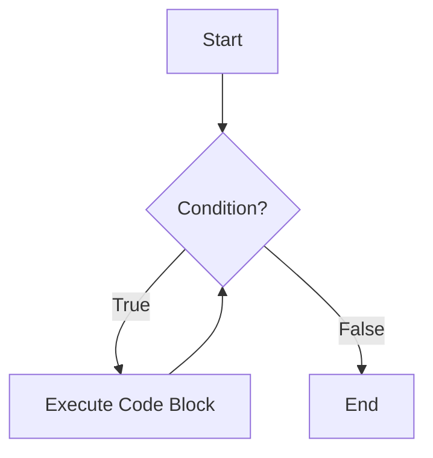
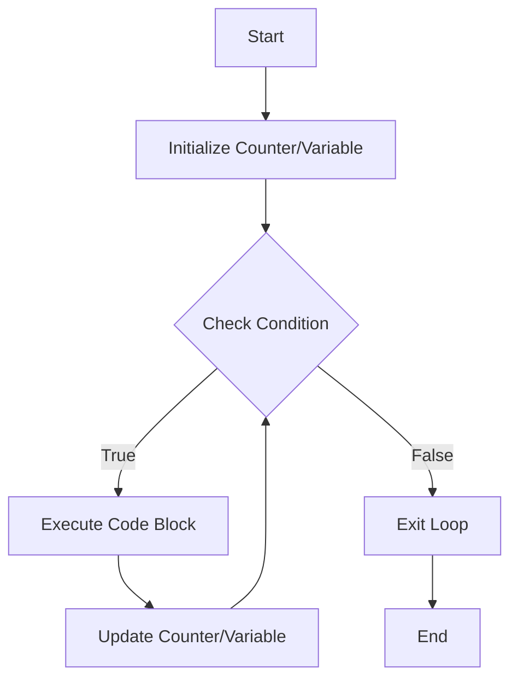
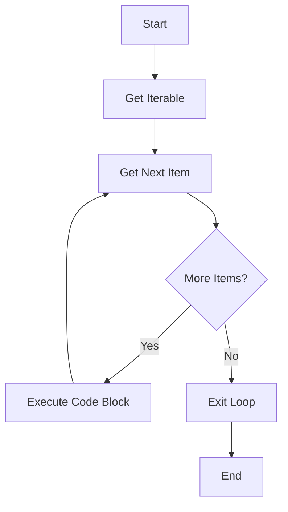
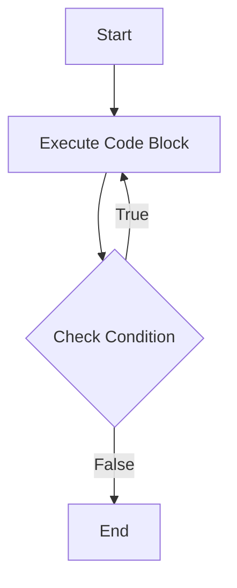
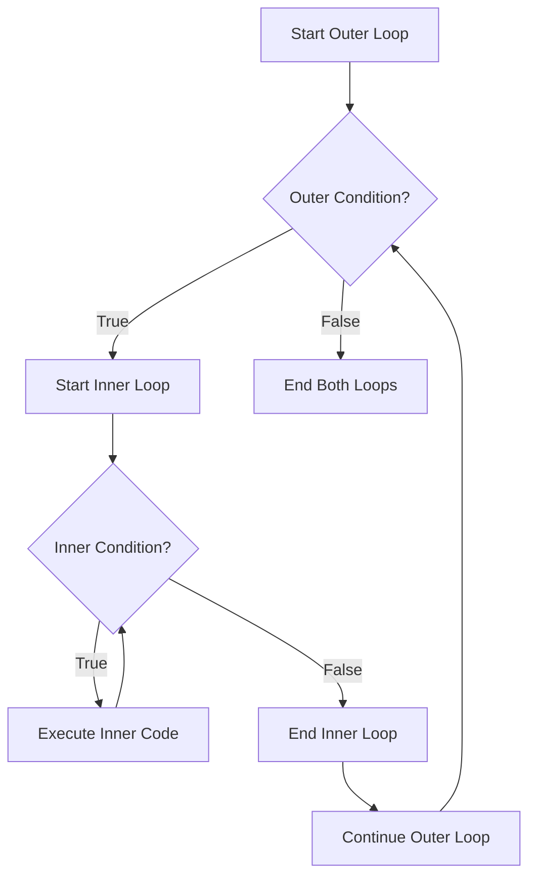

# Python Loops - Complete Guide for DevOps

## Table of Contents
1. [Introduction to Loops](#introduction-to-loops)
2. [While Loops](#while-loops)
3. [For Loops](#for-loops)
4. [Do-While Loops (Python Alternative)](#do-while-loops-python-alternative)
5. [Loop Control Statements](#loop-control-statements)
6. [Nested Loops](#nested-loops)
7. [DevOps Use Cases](#devops-use-cases)
8. [Best Practices](#best-practices)

## Introduction to Loops

Loops are fundamental control structures that allow you to execute a block of code repeatedly. In DevOps, loops are essential for automating repetitive tasks like processing log files, managing multiple servers, or iterating through configuration files.



## While Loops

A `while` loop executes a block of code as long as a specified condition remains true.

### Syntax
```python
while condition:
    # code block
    # update condition variable
```

### Flow Diagram


### Basic While Loop Example
```python
# Example 1: Simple counter
count = 0
while count < 5:
    print(f"Count is: {count}")
    count += 1

# Output:
# Count is: 0
# Count is: 1
# Count is: 2
# Count is: 3
# Count is: 4
```

### DevOps Example: Server Health Check
```python
import time
import random

attempts = 0
max_attempts = 5
server_healthy = False

while not server_healthy and attempts < max_attempts:
    print(f"Checking server health... Attempt {attempts + 1}")
    
    # Simulate server status check (random for demo)
    server_healthy = random.choice([True, False])
    
    if not server_healthy:
        print("Server unhealthy, retrying in 5 seconds...")
        time.sleep(5)
        attempts += 1
    else:
        print("Server is healthy!")

if attempts >= max_attempts:
    print("Max attempts reached. Server might be down.")
```

### Infinite While Loop (with break)
```python
# Monitoring logs continuously
while True:
    user_input = input("Enter 'quit' to stop monitoring: ")
    if user_input.lower() == 'quit':
        print("Stopping log monitoring...")
        break
    print("Monitoring logs...")
    # Add actual log monitoring code here
```

## For Loops

A `for` loop iterates over a sequence (list, tuple, dictionary, set, or string) or other iterable objects.

### Syntax
```python
for item in iterable:
    # code block
```

### Flow Diagram


### Basic For Loop Examples

#### Iterating over a list
```python
# Example 1: Process server list
servers = ["web01", "web02", "db01", "cache01"]

for server in servers:
    print(f"Deploying to {server}")
    # Add deployment logic here

# Output:
# Deploying to web01
# Deploying to web02
# Deploying to db01
# Deploying to cache01
```

#### Using range()
```python
# Example 2: Using range for numbered iterations
for i in range(5):
    print(f"Backup iteration {i}")

# Example 3: Range with start, stop, step
for port in range(8080, 8090, 2):
    print(f"Checking port {port}")

# Output:
# Checking port 8080
# Checking port 8082
# Checking port 8084
# Checking port 8086
# Checking port 8088
```

#### Dictionary iteration
```python
# Example 4: Processing configuration
config = {
    "database_host": "db.example.com",
    "database_port": 5432,
    "debug": True,
    "max_connections": 100
}

# Iterate over keys
for key in config:
    print(f"Config key: {key}")

# Iterate over values
for value in config.values():
    print(f"Config value: {value}")

# Iterate over key-value pairs
for key, value in config.items():
    print(f"{key}: {value}")
```

### DevOps Example: Log File Processing
```python
import os

log_files = ["app.log", "error.log", "access.log"]
error_keywords = ["ERROR", "CRITICAL", "FATAL"]

for log_file in log_files:
    print(f"\n--- Processing {log_file} ---")
    
    if not os.path.exists(log_file):
        print(f"Warning: {log_file} not found")
        continue
    
    try:
        with open(log_file, 'r') as file:
            line_number = 0
            for line in file:
                line_number += 1
                for keyword in error_keywords:
                    if keyword in line.upper():
                        print(f"Line {line_number}: {line.strip()}")
                        break
    except Exception as e:
        print(f"Error processing {log_file}: {e}")
```

## Do-While Loops (Python Alternative)

Python doesn't have a built-in do-while loop, but we can simulate it using a while loop with a break statement.

### Traditional Do-While Concept


### Python Implementation Methods

#### Method 1: While True with break
```python
# Simulate do-while: execute at least once
while True:
    # Code that executes at least once
    user_input = input("Enter a command (or 'exit' to quit): ")
    print(f"You entered: {user_input}")
    
    # Condition check
    if user_input.lower() == 'exit':
        break
```

#### Method 2: Initialize condition to ensure first execution
```python
# Alternative approach
first_run = True
continue_loop = True

while first_run or continue_loop:
    first_run = False
    
    # Code block
    response = input("Do you want to continue? (y/n): ")
    continue_loop = response.lower() == 'y'
    print(f"You chose to continue: {continue_loop}")
```

### DevOps Example: Interactive Deployment Script
```python
# Do-while simulation for deployment menu
while True:
    print("\n=== Deployment Menu ===")
    print("1. Deploy Web Service")
    print("2. Deploy Database")
    print("3. Deploy Cache")
    print("4. Exit")
    
    choice = input("Select an option: ")
    
    if choice == '1':
        print("Deploying Web Service...")
        # Add actual deployment logic here
    elif choice == '2':
        print("Deploying Database...")
        # Add actual deployment logic here
    elif choice == '3':
        print("Deploying Cache...")
        # Add actual deployment logic here
    elif choice == '4':
        print("Exiting deployment script...")
        break
    else:
        print("Invalid option. Please try again.")
    
    # This ensures the menu shows at least once
    # and continues until user chooses to exit
```

## Loop Control Statements

### Break Statement
Terminates the loop prematurely when a specific condition is met.

```python
# Example: Stop processing when critical error found
log_entries = ["INFO: App started", "DEBUG: User login", "CRITICAL: Database down", "INFO: App stopped"]

for entry in log_entries:
    print(f"Processing: {entry}")
    if "CRITICAL" in entry:
        print("Critical error found! Stopping log processing.")
        break
```

### Continue Statement
Skips the current iteration and moves to the next one.

```python
# Example: Skip non-error log entries
log_entries = ["INFO: App started", "ERROR: Connection failed", "DEBUG: User login", "ERROR: Timeout"]

for entry in log_entries:
    if "ERROR" not in entry:
        continue  # Skip non-error entries
    print(f"Error found: {entry}")
```

### Else Clause with Loops
The `else` clause executes when the loop completes normally (not terminated by break).

```python
# Example: Search for a specific server
servers = ["web01", "web02", "db01"]
target_server = "cache01"

for server in servers:
    if server == target_server:
        print(f"Found {target_server}")
        break
else:
    print(f"{target_server} not found in server list")
```

## Nested Loops

Loops inside other loops are useful for processing multi-dimensional data.



### Example: Multi-Environment Deployment
```python
environments = ["dev", "staging", "prod"]
services = ["api", "frontend", "database"]

for env in environments:
    print(f"\n=== Deploying to {env.upper()} ===")
    for service in services:
        print(f"  Deploying {service} to {env}")
        # Add actual deployment logic here
        
        # Simulate deployment time
        import time
        time.sleep(1)
    print(f"All services deployed to {env}")
```

## DevOps Use Cases

### 1. File Processing
```python
import os
import glob

# Process all configuration files
config_files = glob.glob("*.conf")

for config_file in config_files:
    print(f"Validating {config_file}")
    with open(config_file, 'r') as file:
        line_num = 0
        for line in file:
            line_num += 1
            if line.strip().startswith('#'):
                continue  # Skip comments
            
            if '=' not in line and line.strip():
                print(f"  Warning: Line {line_num} missing '=' operator")
```

### 2. Service Health Monitoring
```python
import requests
import time

services = [
    {"name": "API Gateway", "url": "http://api.example.com/health"},
    {"name": "Database", "url": "http://db.example.com/status"},
    {"name": "Cache", "url": "http://cache.example.com/ping"}
]

monitoring = True
while monitoring:
    print("\n--- Health Check Report ---")
    
    for service in services:
        try:
            response = requests.get(service["url"], timeout=5)
            status = "✅ HEALTHY" if response.status_code == 200 else "❌ UNHEALTHY"
            print(f"{service['name']}: {status}")
        except requests.RequestException as e:
            print(f"{service['name']}: ❌ UNREACHABLE - {e}")
    
    print("\nWaiting 30 seconds for next check...")
    time.sleep(30)
    
    # In real scenario, you'd have a condition to stop monitoring
    # For demo, we'll break after first iteration
    break
```

### 3. Batch Operations
```python
# Batch process multiple servers
servers = [
    {"host": "web01.example.com", "type": "web"},
    {"host": "web02.example.com", "type": "web"},
    {"host": "db01.example.com", "type": "database"}
]

operations = ["update_packages", "restart_services", "check_disk_space"]

for server in servers:
    print(f"\n--- Processing {server['host']} ---")
    
    for operation in operations:
        print(f"  Executing {operation}...")
        
        # Simulate operation based on server type
        if server['type'] == 'database' and operation == 'restart_services':
            print("    Warning: Database restart requires maintenance window")
            continue
        
        # Simulate operation execution
        time.sleep(1)
        print(f"    ✅ {operation} completed")
```

## Best Practices

### 1. Avoid Infinite Loops
```python
# ❌ Bad: Potential infinite loop
# while True:
#     print("This will run forever!")

# ✅ Good: Always have an exit condition
max_attempts = 10
attempts = 0

while attempts < max_attempts:
    # Do something
    attempts += 1
    if some_condition:
        break
```

### 2. Use Appropriate Loop Type
```python
# ✅ Use for loop when you know the number of iterations
for i in range(5):
    print(f"Iteration {i}")

# ✅ Use while loop when condition-based
while user_wants_to_continue():
    process_request()
```

### 3. Keep Loop Bodies Simple
```python
# ✅ Good: Extract complex logic into separate blocks
for entry in log_entries:
    # Process each log entry directly
    if "ERROR" in entry:
        print(f"Error found: {entry}")
        # Add error handling logic here
    elif "WARNING" in entry:
        print(f"Warning found: {entry}")
        # Add warning handling logic here
```

### 4. Handle Exceptions in Loops
```python
# ✅ Good: Handle exceptions to prevent loop termination
file_list = ["config.txt", "logs.txt", "missing.txt"]

for file_name in file_list:
    try:
        with open(file_name, 'r') as file:
            content = file.read()
            print(f"Processed {file_name}: {len(content)} characters")
    except FileNotFoundError:
        print(f"Warning: {file_name} not found, skipping...")
    except Exception as e:
        print(f"Error processing {file_name}: {e}")
```

### 5. Use List Comprehensions When Appropriate
```python
# Traditional loop
numbers = [1, 2, 3, 4, 5, 6, 7, 8, 9, 10]
even_squares = []
for num in numbers:
    if num % 2 == 0:
        even_squares.append(num ** 2)

# ✅ More Pythonic: List comprehension
numbers = [1, 2, 3, 4, 5, 6, 7, 8, 9, 10]
even_squares = [num ** 2 for num in numbers if num % 2 == 0]
```

## Summary

| Loop Type | Use Case | Key Features |
|-----------|----------|--------------|
| **while** | Unknown iterations, condition-based | Continues while condition is True |
| **for** | Known iterations, sequence processing | Iterates over iterable objects |
| **do-while** | At least one execution required | Simulated in Python with while True + break |

### Quick Reference

```python
# While loop
while condition:
    # code
    pass

# For loop
for item in sequence:
    # code
    pass

# Do-while simulation
while True:
    # code
    if not condition:
        break

# With loop control
for item in sequence:
    if skip_condition:
        continue
    if stop_condition:
        break
    # process item
```

Remember: In DevOps, loops are your friends for automation, monitoring, and batch processing. Choose the right loop type for your specific use case and always consider error handling and exit conditions!